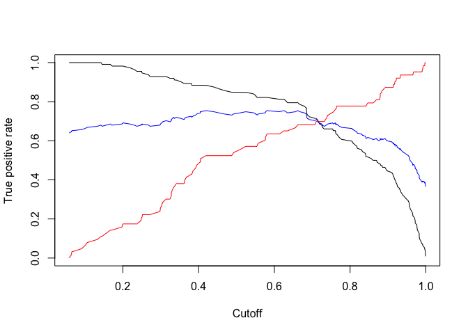

Credit Card Profittability
================

## Predicting weather a Credit Card account is profitable or not.

## Part 1: Data Preparation

1)  Wrangling

<!-- end list -->

``` r
# Adding the profitable column
creditDF$PROFITABLE <- ifelse(creditDF$PROFIT >= 0 , 1, 0)

#Making CHK_ACCT, SAV_ACCT, HISTORY, JOB, and TYPE as factors
creditDF$CHK_ACCT <- as.factor(creditDF$CHK_ACCT)
creditDF$SAV_ACCT <- as.factor(creditDF$SAV_ACCT)
creditDF$HISTORY <- as.factor(creditDF$HISTORY)
creditDF$JOB <- as.factor(creditDF$JOB)
creditDF$TYPE <- as.factor(creditDF$TYPE)
creditDF$PROFITABLE <- as.factor(creditDF$PROFITABLE)
```

2)  Setting the Seed and Splitting

<!-- end list -->

``` r
# Setting the seed
set.seed(12345)

# 30% as test data and 70% as rest
test_instn = sample(nrow(creditDF), 0.3*nrow(creditDF))
creditTestDF <- creditDF[test_instn,]
creditRestDF <- creditDF[-test_instn,]

# 25% as validation data and 75% as training data
valid_instn = sample(nrow(creditRestDF), 0.25*nrow(creditRestDF))
creditValidDF <- creditRestDF[valid_instn,]
creditTrainDF <- creditRestDF[-valid_instn,]
```

## Part 2: Logistic regression

1)  Training a logistic regression model to predict your newly created
    categorical dependent variable PROFITABLE, using AGE, DURATION,
    RENT, TELEPHONE, FOREIGN, and the factors you created from
    CHK\_ACCT, SAV\_ACCT, HISTORY, JOB, and TYPE.

<!-- end list -->

``` r
#LogisticRegression
LogisticsRegression <- glm(PROFITABLE~AGE+DURATION+RENT+
                             TELEPHONE+FOREIGN+CHK_ACCT+
                             SAV_ACCT+HISTORY+JOB+TYPE, data = creditTrainDF, family = 'binomial')

#Predicting using the predict function
logisticPrediction <- predict(LogisticsRegression, newdata = creditValidDF, type = 'response')

logisticTestPrediction <- predict(LogisticsRegression, newdata = creditTestDF, type = 'response')
```

2)  Plot the accuracy, sensitivity(TPR), and specificity(TNR) against
    all cutoff values (using the ROCR package) for the validation data.
    What is that maximum accuracy value? At what value of the cutoff is
    the accuracy maximized?

<!-- end list -->

``` r
logisticPred <- prediction(logisticPrediction,creditValidDF$PROFITABLE)
logisticTPR = performance(logisticPred, measure = 'tpr')
logisticTNR <- performance(logisticPred, measure = 'tnr')
logisticACC <- performance(logisticPred, measure = 'acc')
logisticROC <- performance(logisticPred, measure = 'tpr', x.measure = 'fpr')

plot(logisticTPR, ylim=c(0,1))
plot(logisticTNR, add= T, col = 'red')
plot(logisticACC, add = T, col = 'blue')
```

<!-- -->

``` r
best = which.max(slot(logisticACC,"y.values")[[1]])
maxACC = slot(logisticACC,"y.values")[[1]][best]
```

Maximum accuracy = 0.7542 Cutoff = 0.6619

3)  ROC curves for both the training and validation data on the same
    chart.

<!-- end list -->

``` r
logisticPredictionTraining <- predict(LogisticsRegression, newdata = creditTrainDF, type = 'response')

logisticTrainPred <- prediction(logisticPredictionTraining, creditTrainDF$PROFITABLE)
logisticTrainROC = performance(logisticTrainPred, measure = "tpr", x.measure = "fpr")
plot(logisticTrainROC, col = 'red')
plot(logisticROC, add = T, col = 'blue')
```

<!-- -->

Nothing Unexpected but the training data is expected to have a higher
AUC

4)  Plot the lift curve for the validation
data

<!-- end list -->

``` r
liftValid = performance(logisticPred, measure = "lift", x.measure = "rpp")
plot(liftValid)
```

<!-- -->

Maximum lift - 1.5625 For 20% of the loans lift is - 1.39 Lift of 1.3
maximum Positive predictions - 48%

## Part 3: Classfication Trees

1)  Classification Tree algorithm to predict PROFITABLE using the
    training data and the variables you used in your logistic regression
    model. Experimenting with different tree sizes by modifying the
    number of terminal nodes in the tree. Using 10 values: 2, 4, 6, 8,
    10, 12, 14, 16, 18, 20, as well as the full (unpruned) tree.

<!-- end list -->

``` r
creditTree = tree(PROFITABLE~AGE+DURATION+RENT+
                             TELEPHONE+FOREIGN+CHK_ACCT+
                             SAV_ACCT+HISTORY+JOB+TYPE, data = creditTrainDF)

fullTree0ACC = predict_and_classify(creditTree, creditValidDF, 
                                   creditValidDF$PROFITABLE, 0.5)

trainAcc = c()
validAcc = c()
tNodes = c()

for(i in c(2, 4, 6, 8, 10, 12, 14, 16, 18, 20)){
  prunedTree = prune.tree(creditTree, best = i)
  validAcc = c(validAcc, predict_and_classify(prunedTree, creditValidDF, 
                                   creditValidDF$PROFITABLE, 0.5))
  trainAcc = c(trainAcc, predict_and_classify(prunedTree, creditTrainDF, 
                                   creditTrainDF$PROFITABLE, 0.5))
  tNodes = c(tNodes, i)
}
```

    ## Warning in prune.tree(creditTree, best = i): best is bigger than tree size
    
    ## Warning in prune.tree(creditTree, best = i): best is bigger than tree size
    
    ## Warning in prune.tree(creditTree, best = i): best is bigger than tree size
    
    ## Warning in prune.tree(creditTree, best = i): best is bigger than tree size

``` r
treeDF = data.frame(tNodes, trainAcc, validAcc)
treeDF
```

    ##    tNodes  trainAcc  validAcc
    ## 1       2 0.7066667 0.6400000
    ## 2       4 0.7600000 0.6571429
    ## 3       6 0.8019048 0.6914286
    ## 4       8 0.8019048 0.6914286
    ## 5      10 0.8038095 0.6685714
    ## 6      12 0.8038095 0.6685714
    ## 7      14 0.8038095 0.6685714
    ## 8      16 0.8038095 0.6685714
    ## 9      18 0.8038095 0.6685714
    ## 10     20 0.8038095 0.6685714

2)  Cutoff of 0.5 to classify accounts and measure the accuracy in the
    training and validation data for each tree. Plot the tree size
    versus accuracy in the training and validation data (respectively)
    and select the best tree size.

<!-- end list -->

``` r
ggplot() + 
  geom_line(data = treeDF, aes(x = tNodes, y = trainAcc), color = 'red') +
  geom_line(data = treeDF, aes(x = tNodes, y = validAcc), color = 'blue')
```

<!-- -->

3)  Plot the tree that results in the best accuracy in the validation
    data.

<!-- end list -->

``` r
prunedTree = prune.tree(creditTree, best = 6)
plot(prunedTree)
text(prunedTree,pretty=1)
```

<!-- -->

The best accuracy is for 6 terminal nodes.

## Part4: KNN Algorithm

1)  kNN algorithm for classification on the training data using the
    following variables: AGE, DURATION, RENT, TELEPHONE, FOREIGN,
    CHK\_ACCT, SAV\_ACCT, HISTORY, JOB, and TYPE

2)  Trying ten values of k: 1, 3, 5, 7, 11, 15, 21, 25, 31, and 35.

<!-- end list -->

``` r
creditKNNDF <- read_csv("Data/Credit_Dataset.csv")
```

    ## Parsed with column specification:
    ## cols(
    ##   .default = col_double()
    ## )

    ## See spec(...) for full column specifications.

``` r
creditKNNDF$PROFITABLE <- ifelse(creditKNNDF$PROFIT >= 0 , 1, 0)
creditKNNDF$PROFITABLE <- as.numeric(creditKNNDF$PROFITABLE)
set.seed(12345)

# 30% as test data and 70% as rest
#creditKNNDF <- creditKNNDF[,c(2,3,4,6,7,10,12,17,18,20,24)]
test_instn = sample(nrow(creditKNNDF), 0.3*nrow(creditKNNDF))
creditKNNTestDF <- creditKNNDF[test_instn,]
creditKNNRestDF <- creditKNNDF[-test_instn,]

# 25% as validation data and 75% as training data
valid_instn = sample(nrow(creditKNNRestDF), 0.25*nrow(creditKNNRestDF))
creditKNNValidDF <- creditKNNRestDF[valid_instn,]
creditKNNTrainDF <- creditKNNRestDF[-valid_instn,]


# Training the KNN with k = 1
creditKNNTrainDF.X = creditKNNTrainDF[,c(2,3,4,6,7,10,12,17,18,20)]
creditKNNValidDF.X = creditKNNValidDF[,c(2,3,4,6,7,10,12,17,18,20)]
creditKNNTrainDF.Y = creditKNNTrainDF$PROFITABLE
creditKNNValidDF.Y = creditKNNValidDF$PROFITABLE
creditKNNTestDF.X = creditKNNTestDF[,c(2,3,4,6,7,10,12,17,18,20)]
creditKNNTestDF.Y = creditKNNTestDF$PROFITABLE

# Empty vectors to store accuracier
kValue = c()
validAcc = c()
trainAcc = c()

#For loop to iterate over various k values and then get the accuracies for both the #training set and Validation set
for(i in c(1, 3, 5, 7, 11, 15, 21, 25, 31, 35)){
  knnPredValid = knn(creditKNNTrainDF.X, creditKNNValidDF.X, creditKNNTrainDF.Y, k = i)
  knnPredTrain = knn(creditKNNTrainDF.X, creditKNNTrainDF.X, creditKNNTrainDF.Y, k = i)
  kValue = c(kValue, i)
  validAcc = c(validAcc, class_performance(table(creditKNNValidDF.Y, knnPredValid))[1])
  trainAcc = c(trainAcc, class_performance(table(creditKNNTrainDF.Y, knnPredTrain))[1])
}

knnDF = data.frame(kValue, validAcc, trainAcc)
```

2)  Using the output, plot the accuracy for each value of k on both the
    training data and validation data

<!-- end list -->

``` r
ggplot() +
  geom_line(data = knnDF, aes(x = kValue , y = trainAcc), color = "blue") +
  geom_line(data = knnDF, aes(x = kValue, y = validAcc), color = 'red') +
  xlab('K values') +
  ylab('Accuracy') +
  ggtitle("Accuracy for Various K value")
```

<!-- -->

The best value of K is 5, which has the highest accuracy on the
validation set.

## Part 5: Comparing all the three models.

1)  Calculate the accuracy of all three models on the testing
data.

<!-- end list -->

``` r
AccuracyLogistic = class_performance(confusion_matrix(logisticTestPrediction,creditTestDF$PROFITABLE, 0.6619))[1]
print(AccuracyLogistic)
```

    ## [1] 0.6833333

``` r
knnPredTest = knn(creditKNNTrainDF.X, creditKNNTestDF.X, creditKNNTrainDF.Y, k = 5)
class_performance(table(creditKNNTestDF.Y, knnPredTest))[1]
```

    ## [1] 0.7033333

``` r
testAccuracy = predict_and_classify(prunedTree, creditTestDF, 
                                   creditTestDF$PROFITABLE, 0.5)
testAccuracy
```

    ## [1] 0.71

Accuracy on the test data Logistic Regression Accuracy = 68.33% Tree
Accuracy = 71% KNN Accuracy = 70%

The Classification Trees are very good at predicting\!
